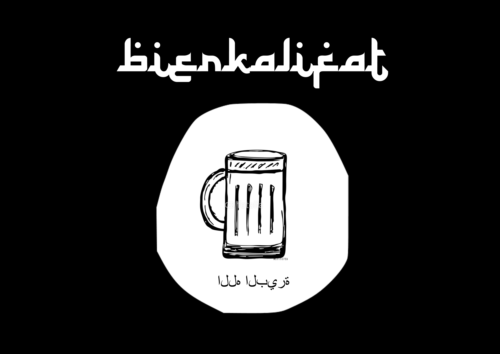

# Allahu Akbier {-}

```{r logo, include=T, echo=FALSE, fig.align='center'}

```

```{r setup, echo=F, message=F, warning=F}
knitr::opts_chunk$set(echo = F)

library(tidyverse)
library(googlesheets4)
library(pander)
library(bookdown)

googlesheets4::gs4_deauth()
data <- read_sheet('1XfbpNN7E1uId8dHC8KYks95R4Gd2gfM6ajKpvTTN2ag')

group_type <- data %>% distinct(type) %>% pull() %>% sort()
group_pos <- data %>% distinct(pos) %>% pull() %>% sort()
labels <- NULL
```

# Vorwort

> Wäre schon wenn der Biermam hier ein Vorwort schreiben könnte

# Inhalt

```{r}
create_section <- function() {
  # "## Title (auto)"
  pandoc.p('\n')
  pandoc.header(paste('Wort', pos_no), level = 2)
  
  pandoc.header(paste('Frage {-}'), level = 3)
  
  question <- data %>% filter(pos == pos_no) %>% pull(question)
  if (is.na(question)) {
    pandoc.p(paste0('_', 'folgt in Kürze', '_'))
  } else {
    pandoc.p(paste('>', question))
  }
  
  pandoc.header(paste('Antwort {-}'), level = 3)
  pandoc.p(data %>% filter(pos == pos_no) %>% pull(message) %>% paste('>', .))
}
```

```{r, results = 'asis'}
for (pos_no in group_pos) {
  create_section()
}
```